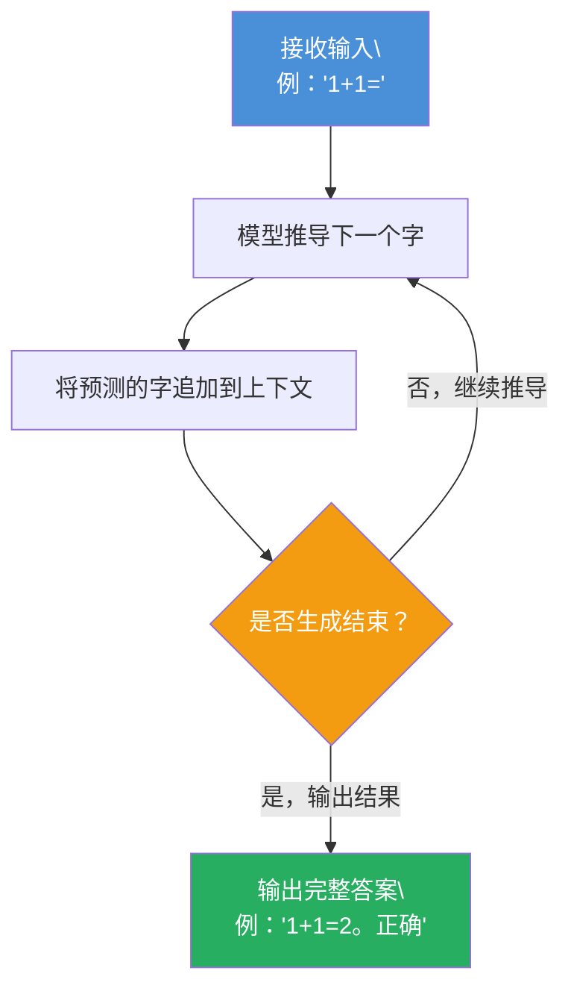
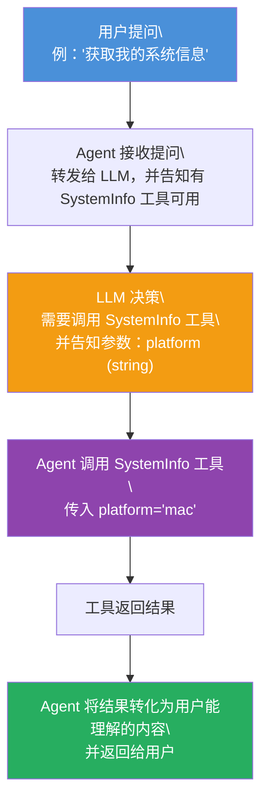
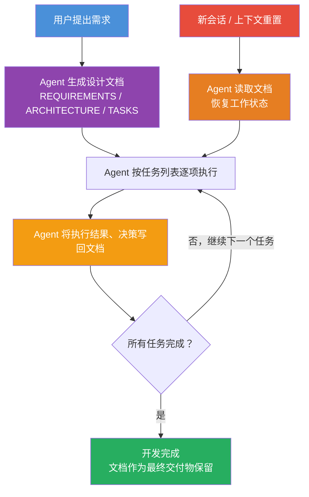

# 背景介绍

自从 2023 年以来由 ChatGPT 引发的 AI 浪潮席卷全球，各种 AI 产品层出不穷，用户体验也日益丰富。本文将介绍一些常见的 AI 工具，并给出一些使用建议。

# AI 工具类型

## Web 端

- [ChatGPT](https://chatgpt.com/)
- [Gemini](https://gemini.google.com/app)
- [DeepSeek](https://chat.deepseek.com/)
- [豆包](https://www.doubao.com/chat/)

## 移动端

- Icons


## 桌面端（CLI）

- Claude Code


- OpenCode


## 桌面端（App）

- OpenCode


- OpenWork


## Web 端（App）

- OpenClaw


## IDE 插件

- Copilot


## 独立 IDE

- Antigravity


- Trae


## 效果演示

1. 使用 OpenWork 或 OpenClaw 生成一个三维模型

   > 提示词：在我的 `E:\test` 文件夹中新建一个三维模型stl文件，两个球体略微相交，置于平面上

2. 使用 OpenCode 从 0 开始生成一个完整的项目

   > 提示词：在我的 `E:\test` 文件夹中新建一个 Visual Studio 2026 的 C++ 项目，用于演示 ZMQ 的通信方式。注意：我本地没有 ZMQ 库，你要负责在项目中安装和配置 ZMQ 库。

3. 使用 Copilot Agent 修改 OpenCode 完成的项目

   > 提示词：为项目里所有的头文件添加符合 Doxygen 规范的注释

# LLM 基础知识

在讲解Agent为什么能做到这些事情之前，我们需要先了解一下LLM的基础知识，LLM全称是Large Language Model，中文叫做大语言模型，它是一种基于深度学习的自然语言处理模型，它能够理解人类的语言，并生成人类能够理解的语言。关于LLM的基础知识，由以下几个视频来讲解：

1. 什么是神经网络
<iframe src="https://player.bilibili.com/player.html?isOutside=true&aid=114240644060353&bvid=BV1MNoRYEEVM&cid=29118171120&p=1" scrolling="no" border="0" frameborder="no" framespacing="0" allowfullscreen="true" width="100%" height="500px"></iframe>

2. 什么是 RNN
<iframe src="https://player.bilibili.com/player.html?isOutside=true&aid=114240644060353&bvid=BV1MNoRYEEVM&cid=29118171120&p=1" scrolling="no" border="0" frameborder="no" framespacing="0" allowfullscreen="true" width="100%" height="500px"></iframe>

3. 什么是 Transformer
<iframe src="https://player.bilibili.com/player.html?isOutside=true&aid=114328522984185&bvid=BV1C3dqYxE3q&cid=29401417977&p=1" scrolling="no" border="0" frameborder="no" framespacing="0" allowfullscreen="true" width="100%" height="500px"></iframe>

**总结：**
- 神经网络是一种模拟人脑神经元结构的计算模型，通过接受训练数据来求解模型的权重参数，从而在后续的使用中接受真实的输入并输出预测结果。当参数足够多、训练数据足够大时，神经网络的效果看起来就像是具有了智能。
- RNN（循环神经网络）是一种特殊的神经网络，它引入了循环结构，可以处理序列数据，比如文本。
- Transformer 是一种新型的序列模型架构，它摒弃了 RNN 的循环结构，转而采用自注意力机制，从而能够并行处理序列数据并生成新的序列内容。

模型训练完成之后，会根据我们的输入反复推导出下一个字，直到生成完整的答案，流程如下： 



当我们在各大门户网站上提问时，实际上我们的问题被进行了包装，变成了类似于“你是一个专业的助手，你的任务是回答用户的问题。用户的问题是：{问题}，请回答用户的问题”，LLM将这个问题输入到模型中，反复推导下一个字，直到推导出完整的答案。

# Agent 工作原理

LLM 刚推出的时候非常惊艳，人们可以向它提问各种问题并得到解答，但是随着时间的推移，人们不再满足于 LLM 只是能够回答问题，还希望 LLM 能够帮助人们完成各种任务，比如写代码、生成图片、生成视频、执行脚本等等。为了实现这个目标，人们做了以下的努力来改进 LLM：

### 1. 中间件

为了让 LLM 能够提供上述服务，需要一个中间件来完成与 LLM 的交互，这个中间件叫做 Agent。它能够将用户的问题加工、打包，转化为 LLM 能够理解的格式，并将 LLM 的回答转化为用户能够理解的结果。

### 2. 输出控制

为了让 Agent 能够解析 LLM 的回答，首先需要规范 LLM 的输出格式。比如，Agent 规定 LLM 回答问题时必须使用 JSON 格式，并具有特定字段，比如 `result`、`success`、`status`、`message`、`data` 等。这样，Agent 就能够可靠地解析 LLM 的回答了。

### 3. MCP（LLM 的手）

MCP 全称是 Model Context Protocol，中文叫做**模型上下文协议**。为了让 LLM 能够调用外部工具，我们需要预先定义一些工具方法，告诉 LLM 有哪些工具可用、如何调用，并询问 LLM 是否需要调用这些工具来完成用户的需求。

一个典型的 MCP 代码如下：
```ts
import { McpServer } from "@modelcontextprotocol/sdk/server/mcp.js";
import { StdioServerTransport } from "@modelcontextprotocol/sdk/server/stdio.js";
import { z } from "zod";

const server = new McpServer({ name: "SystemInfo", version: "1.0.0" });

server.tool("get_system_status", 
  { platform: z.string().describe("操作系统平台") },
  async ({ platform }) => ({
    content: [{ 
      type: "text", 
      text: platform.includes("mac") ? "Intel Mac 2019" : "Windows Dev Environment" 
    }]
  })
);

// 绑定传输层
const transport = new StdioServerTransport();
await server.connect(transport);
```
关于该 MCP 的使用，与 LLM 的对话流程可能如下：



### 4. Skills（LLM 的指导手册）

有时候针对复杂场景，需要给 LLM 一份专项的指导说明，它本质上是一份包含特定领域知识、操作规程和工具使用偏好的说明书。通过这种方式，我们可以像写文档一样，赋予 LLM 处理复杂业务流程的能力。

一个典型的 Skills 文件（`.md` 格式）内容如下：
```md
# Skill: UVCDebugger
# Description: 专门用于处理 UVC 摄像头开发中的跨平台差异验证与调试

## 1. 核心流程
当用户遇到摄像头无法打开或黑屏时，请按以下步骤操作：
1. 调用 `get_system_status` 确认系统环境（Win/Mac）。
2. 调用 `list_devices` 获取设备路径。
3. 如果是 Windows，优先检查 Media Foundation 权限；如果是 Mac，检查权限描述文件。

## 2. 工具调用规范
- 在调用 `capture_frame` 时，必须传入 `width` 和 `height` 参数。
- 如果返回码为 -1，请调用 `get_ffmpeg_error` 翻译错误信息。

## 3. 注意事项
- 优先处理灰度图（Grayscale）转换逻辑的报错。
- 所有的日志信息需按格式输出，方便开发者对比系统差异。
```
每次调用 LLM 时，Agent 会自动将 Skills 的内容插入到 LLM 的输入中，使 LLM 获得相应的领域知识。

MCP 和 Skills 资源可以从以下网站获取：
- [clawhub.ai](https://clawhub.ai/)
- [mcp.directory](https://mcp.directory/)

### 5. AgentLoop

在实际使用中，Agent 针对我们的问题拆分任务，反复推导和自我验证，以确保任务切实有效地执行，直到最终完成：
```ts
async function agentLoop(userPrompt: string, skillDoc: string) {
  let context = `技能文档：${skillDoc}\n用户需求：${userPrompt}`;
  
  while (true) {
    // 1. 决策阶段：LLM 阅读上下文（包括 Skill）决定下一步
    const decision = await llm.chat([
      { role: "system", content: "你是一个拥有 MCP 工具的 Agent，请参考技能文档操作。" },
      { role: "user", content: context }
    ]);

    // 2. 终止条件：LLM 认为任务已完成
    if (decision.type === "final_answer") {
      console.log("任务完成:", decision.content);
      break;
    }

    // 3. 执行阶段：根据 LLM 意图，真正通过 MCP 调用底层方法
    if (decision.type === "call_tool") {
      const toolResult = await mcpServer.execute(decision.toolName, decision.args);
      
      // 4. 反馈阶段：将执行结果喂回上下文，进入下一轮 Loop
      context += `\n工具执行结果 [${decision.toolName}]: ${JSON.stringify(toolResult)}`;
    }
  }
}
```

# 让 Agent 深入到软件工程

现在的 Agent 在工作区基本都有 `Agent.md` 文档用于指导、缓存和记录 Agent 的工作。在开发时，通过让 Agent 生成各种设计文档，一方面用于规范性引导，一方面也用于缓存之前的工作成果，让 Agent 能够记忆之前的工作内容，从而在后续工作中表现更好。

## 文档驱动开发（Document-Driven Development）

在传统软件开发中，文档往往是事后补充的产物。但在 Agent 参与的开发流程中，**文档是驱动开发的核心输入**。推荐的开发流程如下：

### 第一步：生成设计文档

在动手写代码之前，先让 Agent 根据需求生成设计文档，包括：

- **需求文档**（`REQUIREMENTS.md`）：描述功能目标、约束条件、验收标准
- **架构文档**（`ARCHITECTURE.md`）：描述模块划分、数据流向、技术选型
- **任务拆解文档**（`TASKS.md`）：将需求拆解为可执行的原子任务，并标注依赖关系

> 提示词示例：根据以下需求，生成一份架构设计文档，包含模块划分和数据流图。

### 第二步：按文档执行开发

Agent 在执行每一个任务时，都应该严格参照设计文档，避免偏离既定方向。每完成一个任务后，Agent 应在文档中标注完成状态，形成进度记录：

```md
## 任务列表
- [x] 初始化项目结构
- [x] 实现用户认证模块
- [ ] 接入第三方支付接口
- [ ] 编写单元测试
```

这样即使 Agent 重启或上下文被清空，下次也能通过读取文档快速恢复工作状态。

### 第三步：将执行结果写回文档（缓存 Agent 结果）

Agent 完成每个阶段后，应将关键结论、决策依据、踩过的坑等信息写回对应文档。这相当于给 Agent 建立一套**持久化记忆**，作用包括：

- **续期上下文**：LLM 的上下文窗口有限，文档是跨会话传递信息的可靠载体
- **避免重复决策**：已经验证过的方案不需要 Agent 再次推导
- **便于人工审查**：开发者可以随时检查 Agent 的决策过程是否合理
- **支持迭代改进**：通过对比前后版本的文档，可以清晰观察到 Agent 的改进轨迹

一个典型的 `AGENT.md` 文档结构如下：

```md
# Agent 工作日志

## 当前目标
实现用户登录功能，支持账号密码和第三方 OAuth 两种方式。

## 已完成工作
- 2026-04-10：完成数据库 User 表设计，见 schema.sql
- 2026-04-10：实现账号密码登录接口，JWT Token 有效期设为 7 天

## 关键决策记录
- 选用 bcrypt 而非 MD5 做密码哈希，原因：MD5 已不安全
- OAuth 回调地址统一为 /auth/callback，便于后续扩展

## 待解决问题
- 第三方 OAuth 在本地开发环境的回调域名配置问题尚未验证
```

整个文档驱动的开发流程如下：



## Agent 工具推荐

### OpenCode + oh-my-opencode插件
- 客户端 + cli
- 免费，开箱即用，模型任意选择
- 开发者定期筛选好用的模型，避免用户迷失在各大模型的选择中
- 收费按token计费，对于轻量用户友好

- 翻墙后更稳定

https://opencode.ai/
https://github.com/code-yeongyu/oh-my-openagent

### OpenWork
- 客户端
- 基于OpenCode的模拟OpenClaw的版本
- 开箱即用，不用像OpenClaw一样各种配置

- 翻墙后更稳定

https://openworklabs.com/

### Copilot
- IDE插件
- 需要付费，但是有一个月的免费试用期
- 默认集成在了各种IDE里，交互友好
- 可以选择不同的模型，适合各种场景

- 翻墙后更稳定

### Trae
- IDE插件 + 独立IDE
- 国产，免费，无需翻墙
- 模型选择有限，不支持vsstudio

### Tencent Cloud CodeBuddy
- IDE插件
- 国产，免费，无需翻墙
- 模型选择有限

- 之前的版本严重拖慢vsstudio启动速度，且易崩溃

### ClaudeCode
- 业界翘楚，各种先发概念的推进者，包括MCP、Agent等
- 功能极其强大

- 需要付费，价格较高，每月20美元，且不提供免费试用期
- 对于中国大陆环境极度不友好，需要强力稳定的翻墙软件，付费困难，且易封号，建议通过Copilot、OpenCode这种第三方Agent间接使用

https://claude.com/product/claude-code
